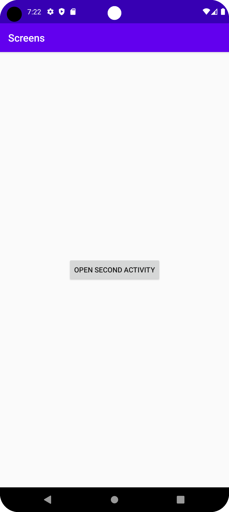
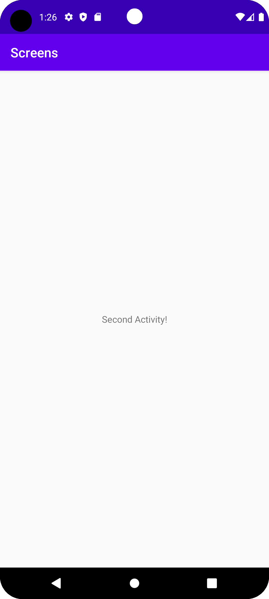

# Rapport

Denna uppgift gick ut på att skapa en ny empty activity som sedan ska man kunna ta sig dit från main activity med en knapp tryck.

Först skapades ett nytt activity och sedan skapades en knapp i activity_main.xml:

```
        <Button
        android:id="@+id/buttonStartSecondActivity"
        android:layout_width="wrap_content"
        android:layout_height="wrap_content"
        android:text="@string/open_second_activity"
        app:layout_constraintBottom_toBottomOf="parent"
        app:layout_constraintLeft_toLeftOf="parent"
        app:layout_constraintRight_toRightOf="parent"
        app:layout_constraintTop_toTopOf="parent" />
```

Configurerade i MainActivity.java, vad som ska hända när knappen trycks. Detta var med hjälp av intent funktionen:

```
    @Override
    protected void onCreate(Bundle savedInstanceState) {
        super.onCreate(savedInstanceState);
        setContentView(R.layout.activity_main);

        Button button = findViewById(R.id.buttonStartSecondActivity);
        button.setOnClickListener(new View.OnClickListener() {
            @Override
            public void onClick(View v) {
                Intent intent = new Intent(MainActivity.this, SecondActivity.class);
                intent.putExtra("EXTRA_DATA", "Second Activity!");
                startActivity(intent);
            }
        });
    }
```

Text lades till i activity_second.xml för att förtydliga att det är second activity:

```
    <TextView
        android:id="@+id/textViewData"
        android:layout_width="wrap_content"
        android:layout_height="wrap_content"
        android:text="No data received"
        app:layout_constraintLeft_toLeftOf="parent"
        app:layout_constraintRight_toRightOf="parent"
        app:layout_constraintTop_toTopOf="parent"
        app:layout_constraintBottom_toBottomOf="parent" />
```


Skärmbilder:

- Main Activity



- Second Activity



